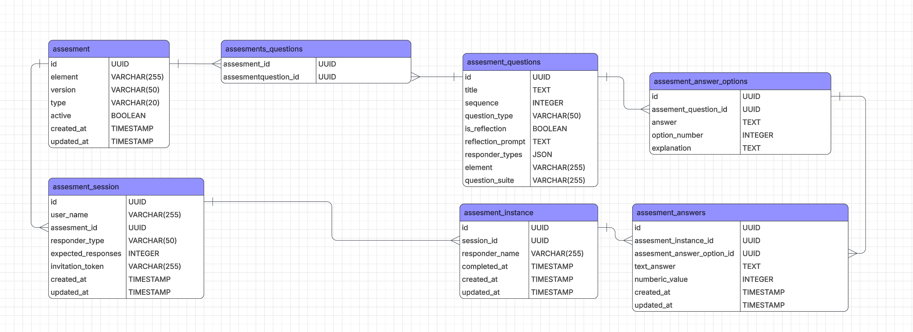

# SOLUTIONS

## Tasks

### ERD Diagram


The entities keep track of questions and answers for a user as they complete assessments. 
The user takes an invitation token and takes part in an assessment where they are given a selection of questions, 
the system then gives the test maker a selection of answer types either one of a given options or text or a number.

The answer the test taker gives is stored in assessment answer entity.

### Understand Scoring

started by setting up postman on my device and reading through the response for d1111111-1111-1111-1111-111111111111

The current percentage given for the element is 53.85 as described in the Phase 2 document. (obtained by using postman)

```
{
    "instance": {
        "id": "d1111111-1111-1111-1111-111111111111",
        "created_at": "2026-02-28 15:18:03",
        "updated_at": "2026-02-28 15:18:03",
        "completed": false,
        "completed_at": null,
        "responder_name": "Test Teacher",
        "element": "1.1"
    },
    "total_questions": 4,
    "answered_questions": 2,
    "completion_percentage": 50,
    "scores": {
        "element": "1.1",
        "total_score": 9,
        "max_score": 15,
        "percentage": 53.85
    },
    "element_scores": {
        "1.1": {
            "element": "1.1",
            "total_questions": 4,
            "answered_questions": 2,
            "completion_percentage": 50,
            "scores": {
                "total_score": 9,
                "max_score": 15,
                "percentage": 53.85
            },
            "question_answers": [
                {
                    "question_id": "a1111111-1111-1111-1111-111111111111",
                    "question_title": "How confident are you in planning engaging lessons?",
                    "question_suite": null,
                    "question_sequence": 1,
                    "is_reflection": false,
                    "reflection_prompt": null,
                    "element": "1.1",
                    "max_score": 5,
                    "is_answered": true,
                    "answer_id": "e1111111-1111-1111-1111-111111111111",
                    "answer_value": 4,
                    "answer_text": "Very confident",
                    "answer_option_id": "b1111111-1111-1111-1111-111111111114",
                    "text_answer": null,
                    "numeric_value": null,
                    "answer_explanation": null,
                    "option_number": 4
                }, ...
            ]
        }
    },
    "insights": [
        {
            "type": "completion",
            "message": "You have 2 questions remaining to complete this assessment.",
            "positive": false
        },
        {
            "type": "performance",
            "message": "You demonstrate strong confidence in this element of teaching practice.",
            "positive": true
        }
    ]
}
```
The normalised percentage is the current percentage of the test taking into account the fact the minimum score is 1.
Therefore, to get a correct percentage you would need to -1 from all the answers to give the correct percentage.

However, there is a bug with the current system. In the event of the assessment being completed the 4th question 
would still be added to the elementAddedQuestion and therefore the percentage given back would become wrong.
So, I am adding an if statement to check if the question is worth points.

I could add a check and add the minimum value for the current percentage (1) if the question has not been answered.
However, I feel as if this is incorrect to do.


## Answers endpoint

my first task is creating the controller to invoke the answers. and testing to see it connects up correctly.


## Resources used

 - [lucid chart](https://lucid.app/lucidchart/91bdae77-6576-4076-84f1-56741071f269/edit?beaconFlowId=6ACFC8B2839F36AA&invitationId=inv_581de3b8-b586-4c44-99f2-c6885d20bc34&page=0_0#)
 - Postman